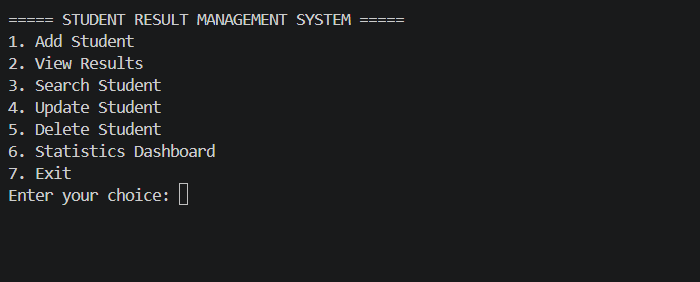
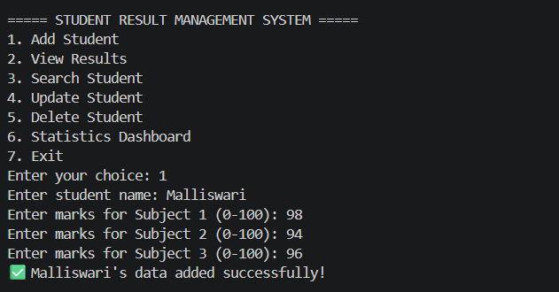
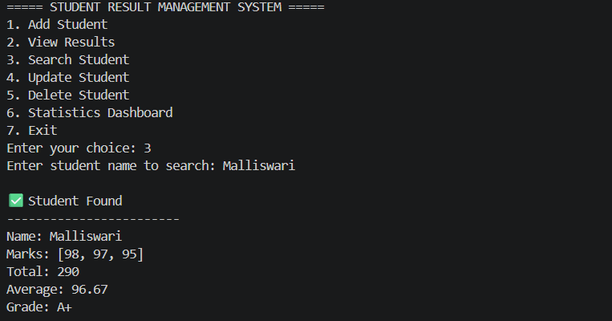
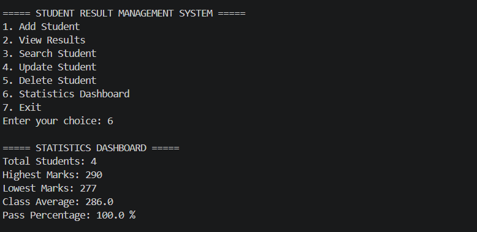

# 🎓 Advanced Student Result Management System

## 📌 Overview

The **Advanced Student Result Management System** is a Python-based console application designed to efficiently manage student academic records. It allows users to add, search, update, delete, and view student results while automatically calculating grades and generating performance statistics.

This project demonstrates the use of **Python programming, functions, file handling, data structures, and data validation** in a real-world academic management system.

---

## ✨ Features

✅ Add Student Records

✅ View All Student Results

✅ Search Student by Name

✅ Update Student Information

✅ Delete Student Records

✅ Automatic Grade Calculation

✅ Topper Identification

✅ Statistics Dashboard

✅ Input Validation

✅ Results File Generation

---

## 📊 Statistics Dashboard

The system provides:

* 📈 Total Number of Students
* 🏆 Highest Marks
* 📉 Lowest Marks
* 📚 Class Average
* ✅ Pass Percentage

---

## 🛠️ Technologies Used

* 🐍 Python
* 📂 File Handling
* 📋 Lists
* 📖 Dictionaries
* 🔄 Functions
* 📊 CSV File Support

---

## 📁 Project Structure

```text
Advanced-Student-Result-Management-System
│
├── screenshots
│   ├── main-menu.png
│   ├── add-student.png
│   ├── search-student.png
│   └── statistics.png
│
├── README.md
├── results.txt
├── students.csv
└── student_result.py
```

---

## 🚀 How to Run

### 1️⃣ Clone the Repository

```bash
git clone https://github.com/karupothulamalliswari3112/Advanced-Student-Result-Management-System.git
```

### 2️⃣ Open the Project Folder

```bash
cd Advanced-Student-Result-Management-System
```

### 3️⃣ Run the Program

```bash
python student_result.py
```

---

## 📸 Screenshots

### 🏠 Main Menu



### ➕ Add Student



### 🔍 Search Student



### 📊 Statistics Dashboard



---

## 🔮 Future Enhancements

* 🖥️ Graphical User Interface (GUI)
* 🗄️ MySQL Database Integration
* 🔐 Student Login System
* 📄 PDF Report Generation
* 📈 Excel Export Functionality

---

## 🎯 Learning Outcomes

Through this project, I gained practical experience in:

* Python Programming
* Problem Solving
* Data Validation
* File Handling
* Data Structures
* Software Development Fundamentals

---

## 👩‍💻 Author

**Karupothula Malliswari**

🔗 GitHub: https://github.com/karupothulamalliswari3112

📂 Project Repository: https://github.com/karupothulamalliswari3112/Advanced-Student-Result-Management-System


